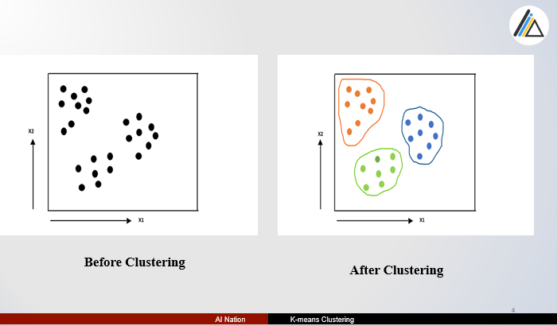
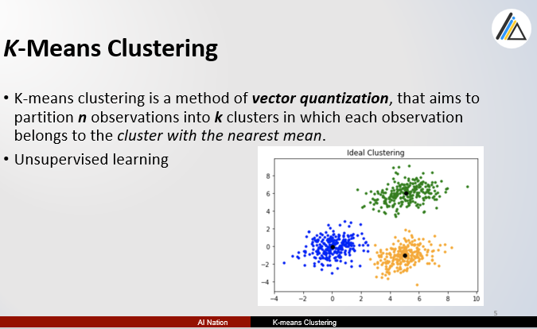
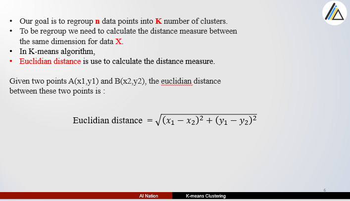
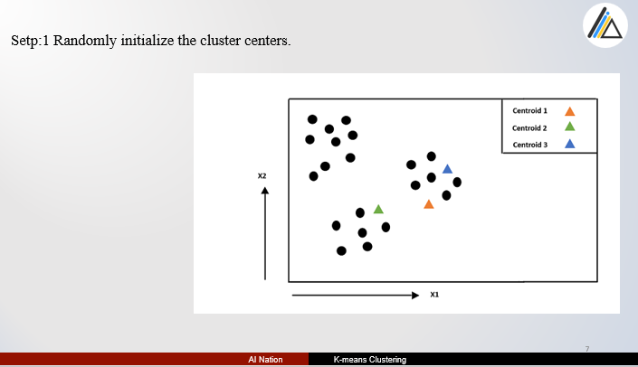
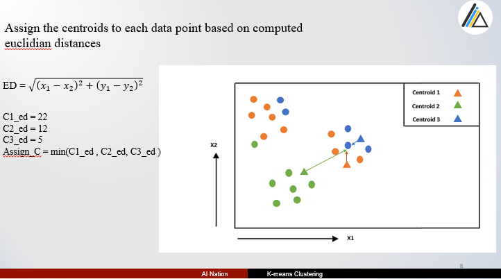
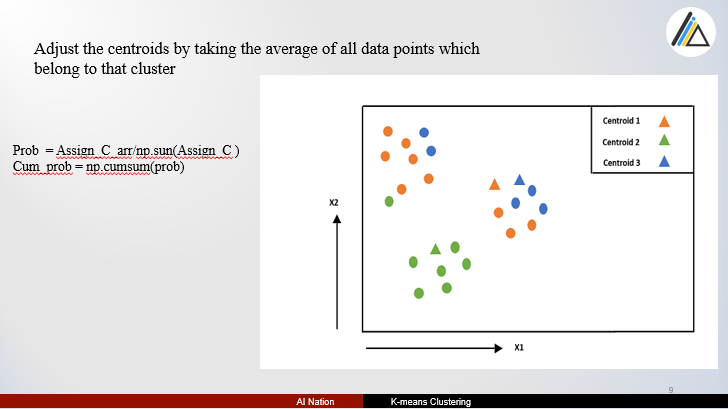
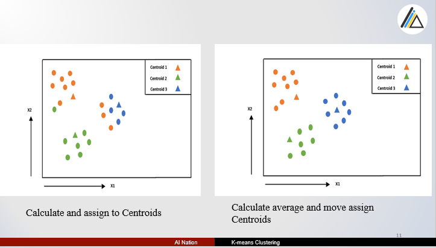
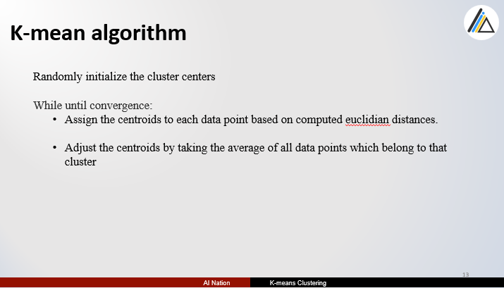
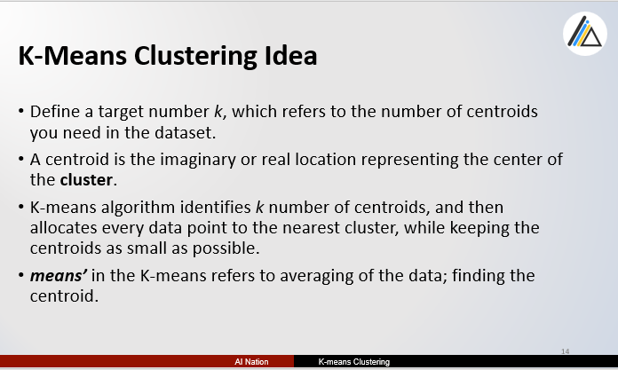
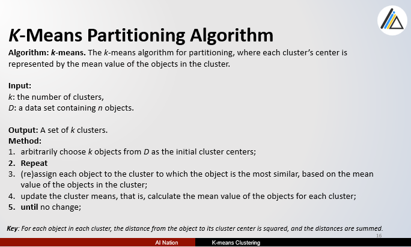

# K-Mean Clustering

*This Presentation is all about my opinion and how I understand the way.*
*So any mistake, be patient me.*
*Ref : HSA University* 

**Source Code**

- [native algorithm source code](https://github.com/tharhtetsan/zero_2_hero_python/blob/3db5bc57bfd395c747e87848258dd919eae0e60c/6_Machine_Learning/K-Mean%20Clustering/k_means_native/K-mean_Clustering_native.ipynb)
- [framework usage source code](https://github.com/tharhtetsan/zero_2_hero_python/blob/3db5bc57bfd395c747e87848258dd919eae0e60c/6_Machine_Learning/K-Mean%20Clustering/k_means_clustering_proj/k_means_Image_Clustering.ipynb)

**If there Any questions?**

You can find me at:

- tharhtet1234@gmail.com
- https://www.facebook.com/tharhtet.san.902
- https://github.com/tharhtetsan
