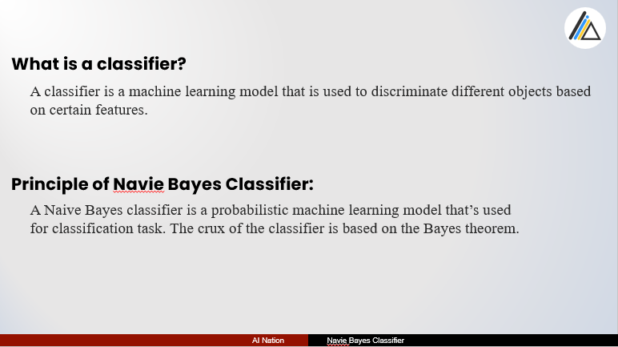
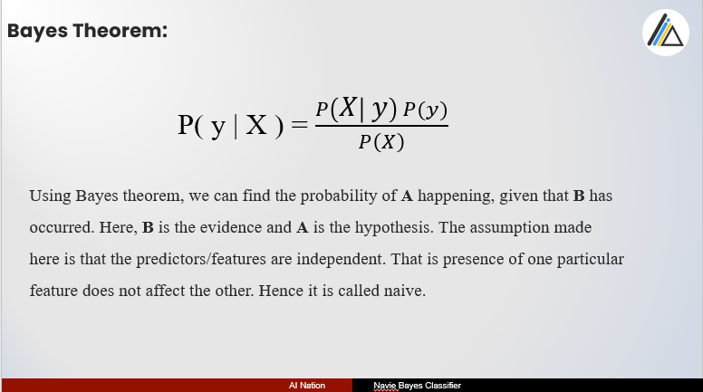
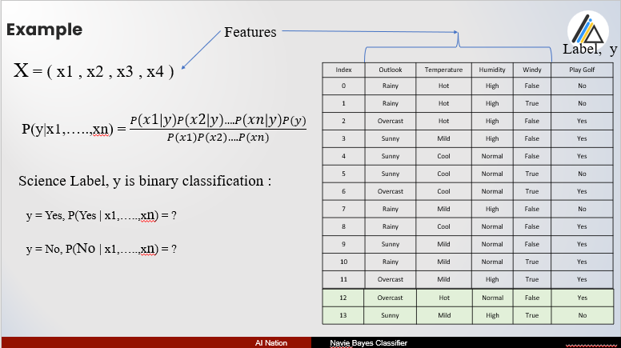
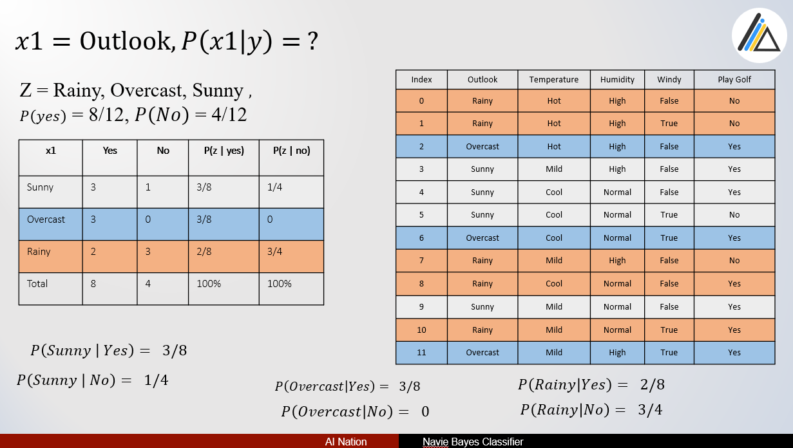
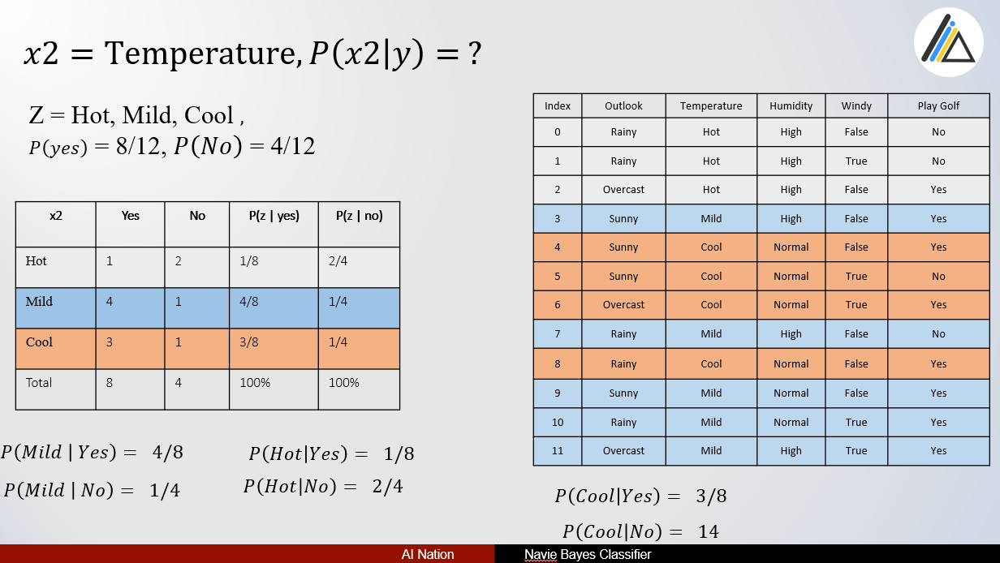
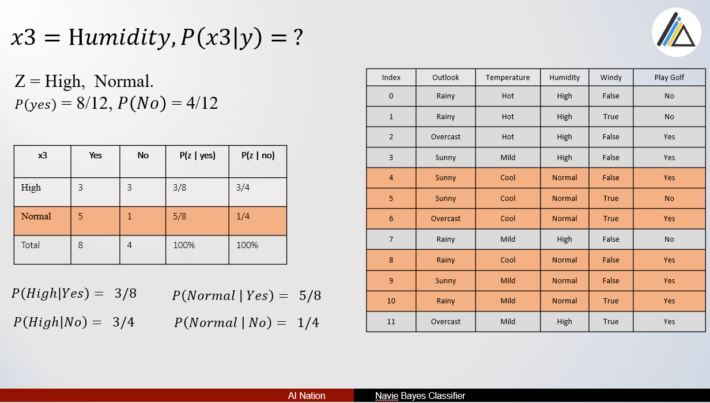
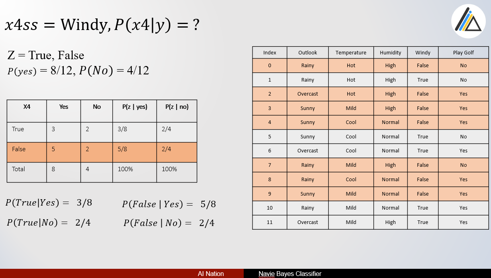
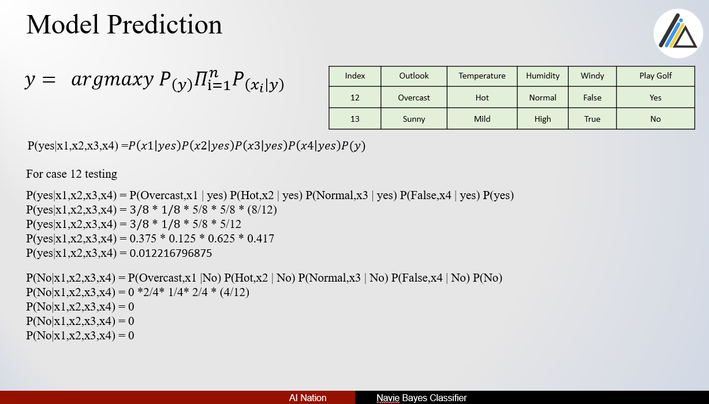
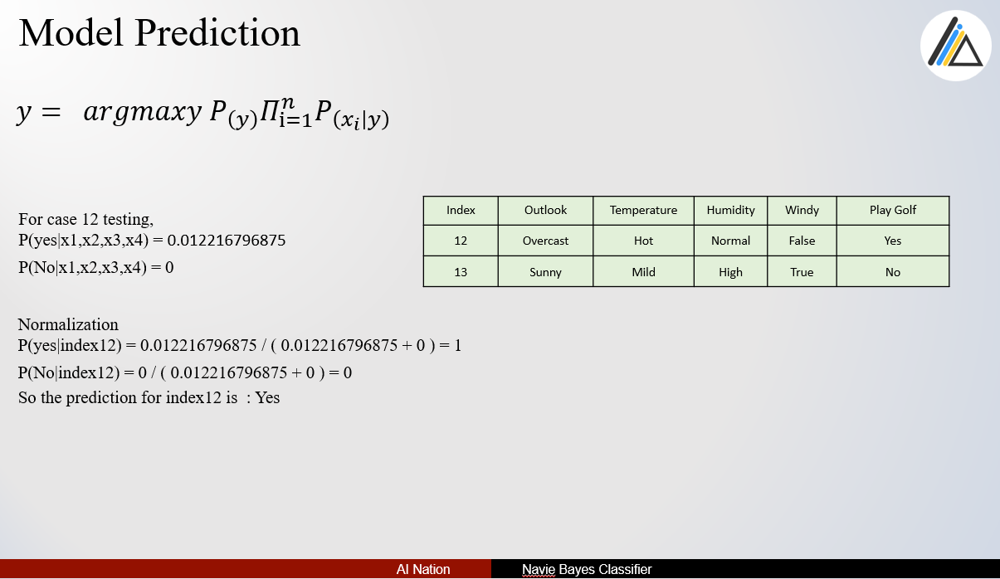

# Decision Tree Algorithm

*This Presentation is all about my opinion and how I understand the way.*
*So any mistake, be patient me.*
*Ref : HSA University* 

**Source Code**

- [native algorithm source code](https://github.com/tharhtetsan/zero_2_hero_python/blob/5401812105a52e48273ba575d2f5aa6e9e1dd0d4/6_Machine_Learning/Naive-Bayes-Classifier/Navie_Bayes_native_to_learn.ipynb)

- [framework usage source code](https://github.com/tharhtetsan/zero_2_hero_python/blob/5401812105a52e48273ba575d2f5aa6e9e1dd0d4/6_Machine_Learning/Naive-Bayes-Classifier/Navie_Bayes_framework.ipynb)

**If there Any questions?**

You can find me at:

- tharhtet1234@gmail.com
- https://www.facebook.com/tharhtet.san.902
- https://github.com/tharhtetsan
