# Decision Tree Algorithm

*This Presentation is all about my opinion and how I understand the way.*
*So any mistake, be patient me.*
*Ref : HSA University* 

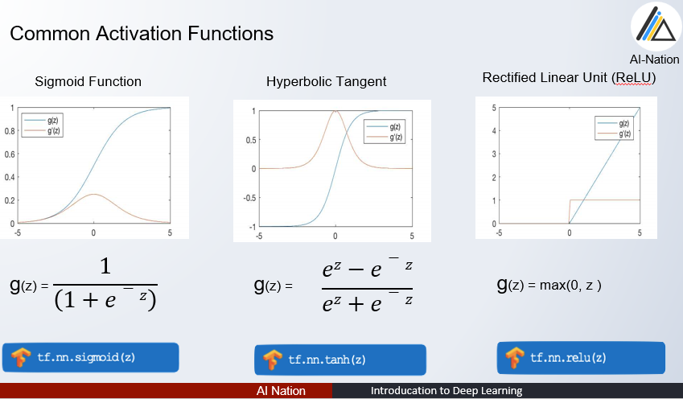

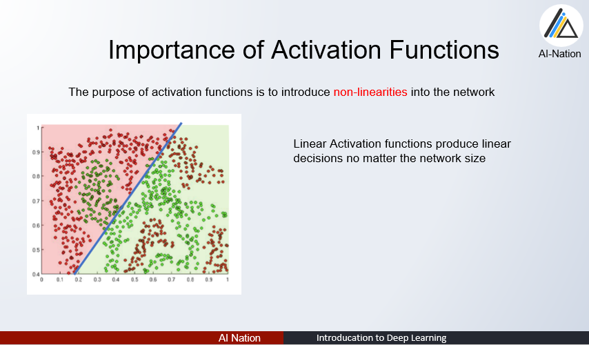

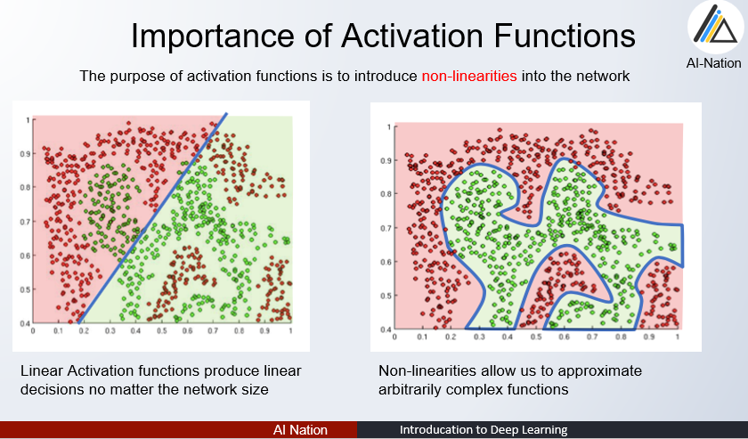

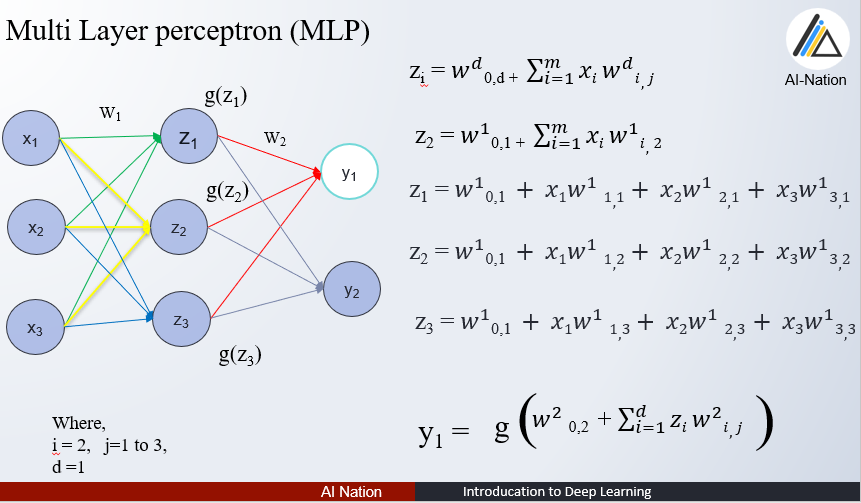

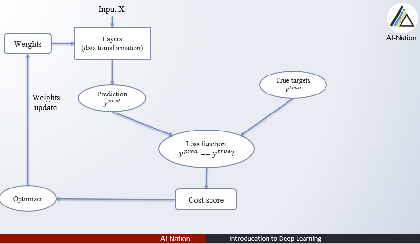

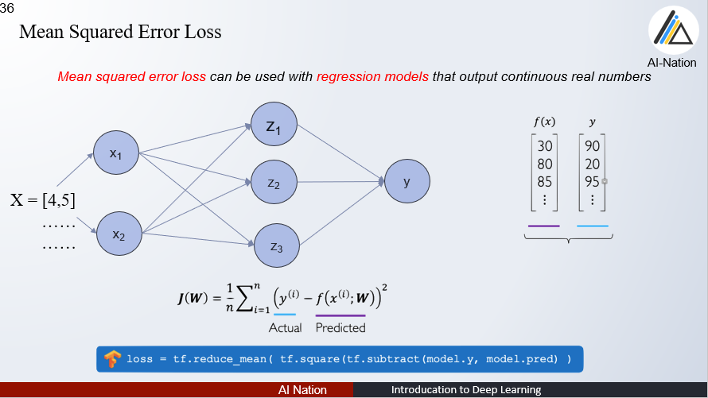

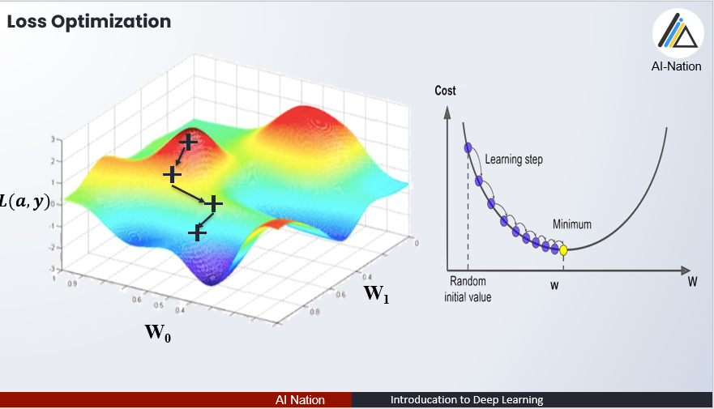

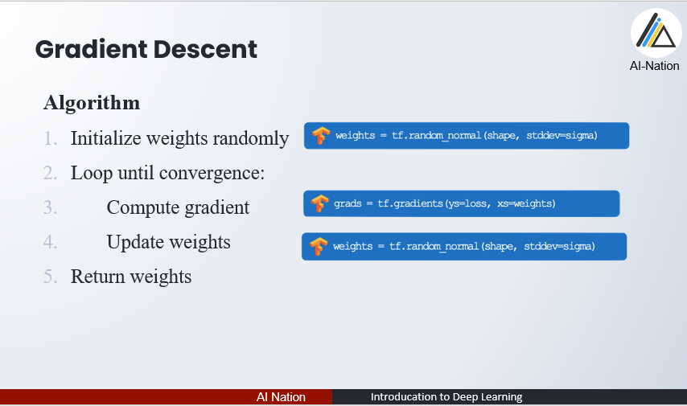

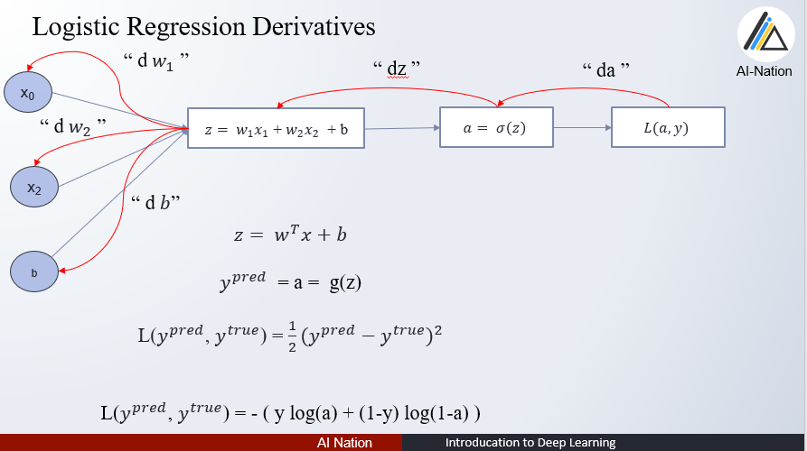

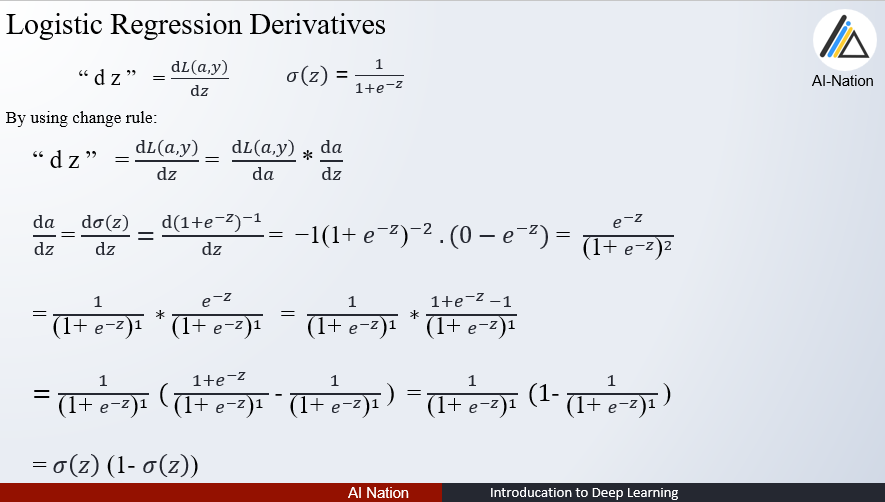

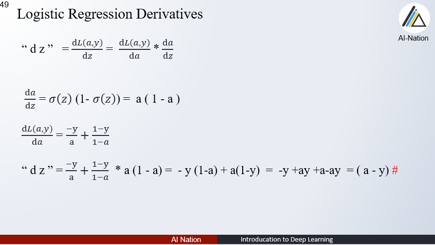
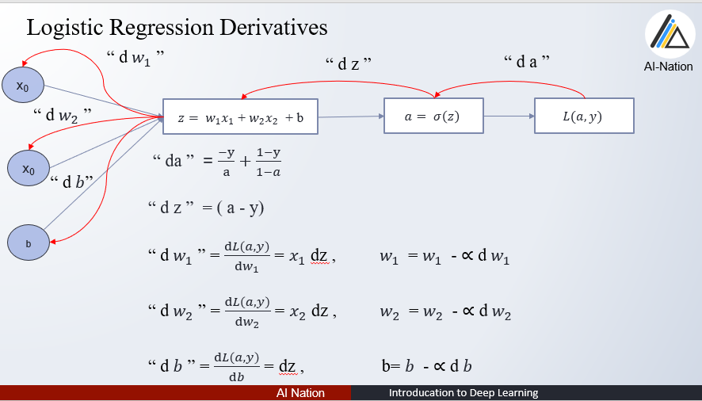

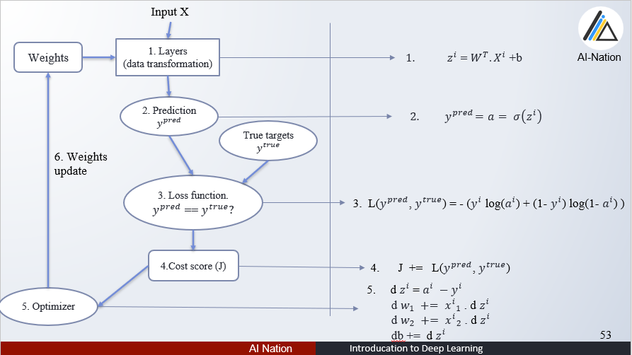

**Source Code**

- [native algorithm source code]()
- [framework usage source code]()

**If there Any questions?**

You can find me at:

- tharhtet1234@gmail.com
- https://www.facebook.com/tharhtet.san.902
- https://github.com/tharhtetsan
