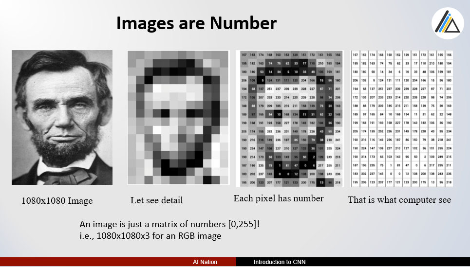
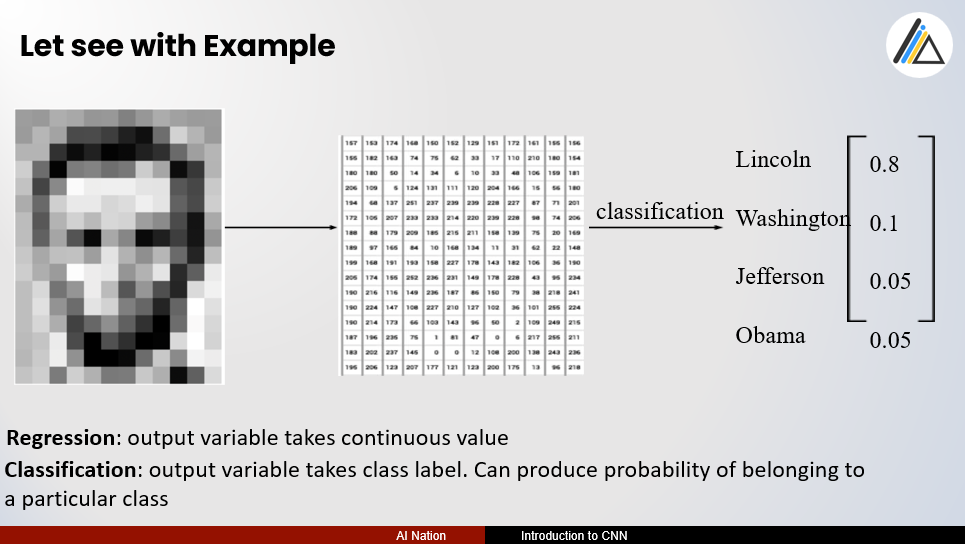
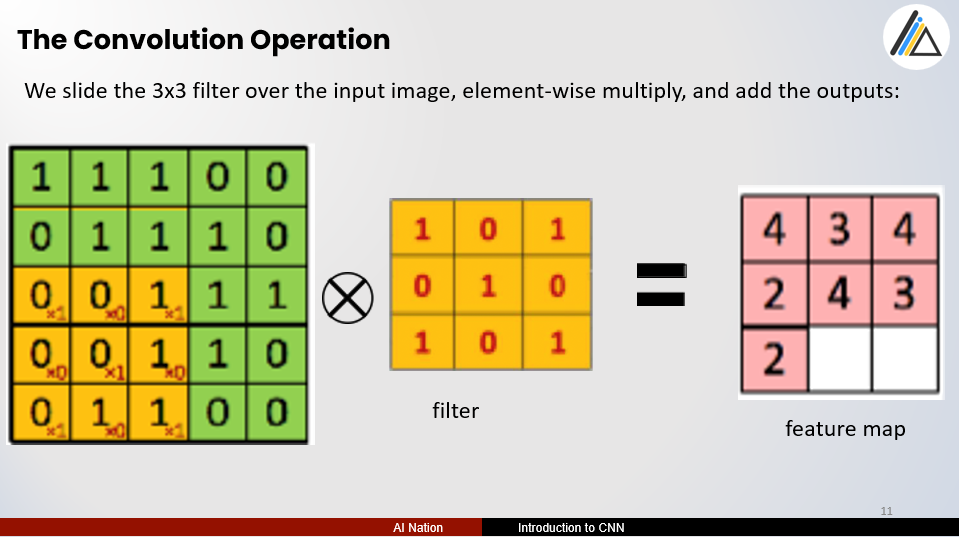
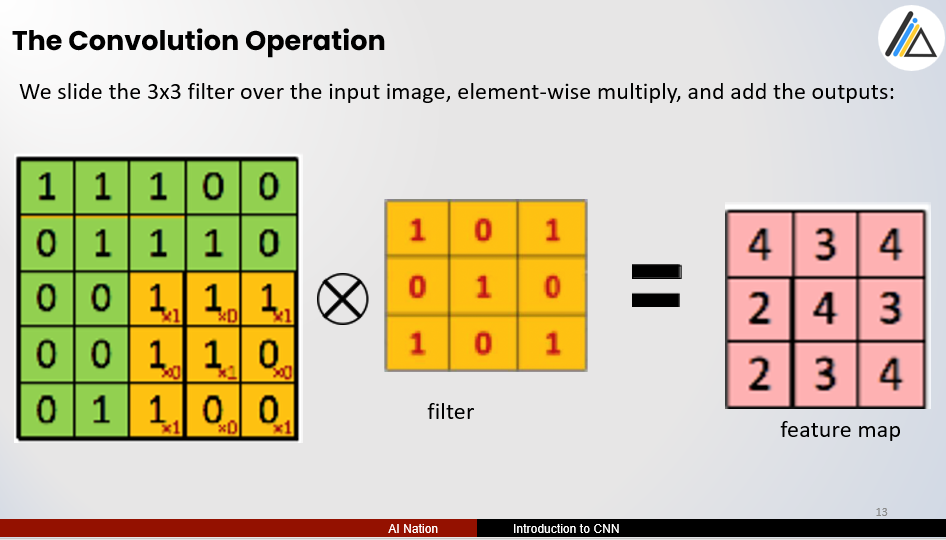
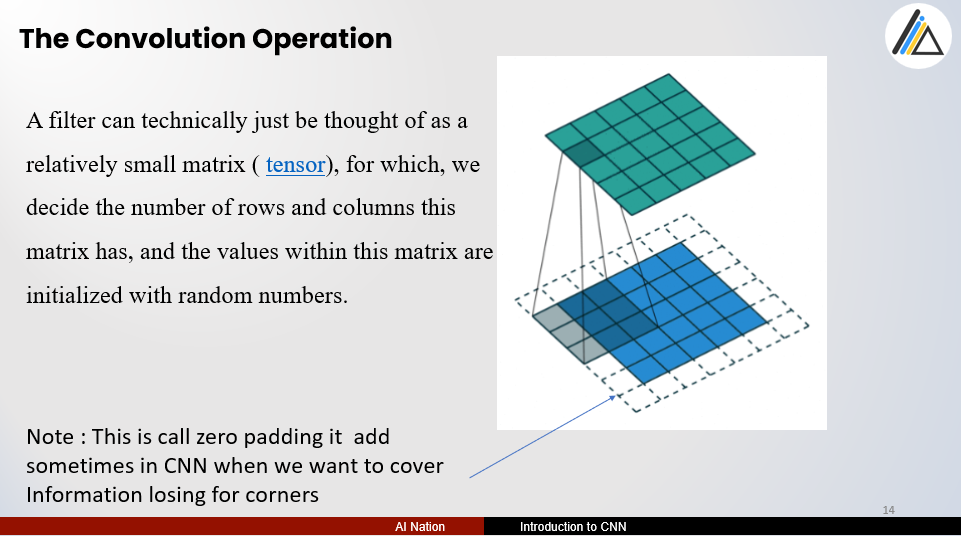
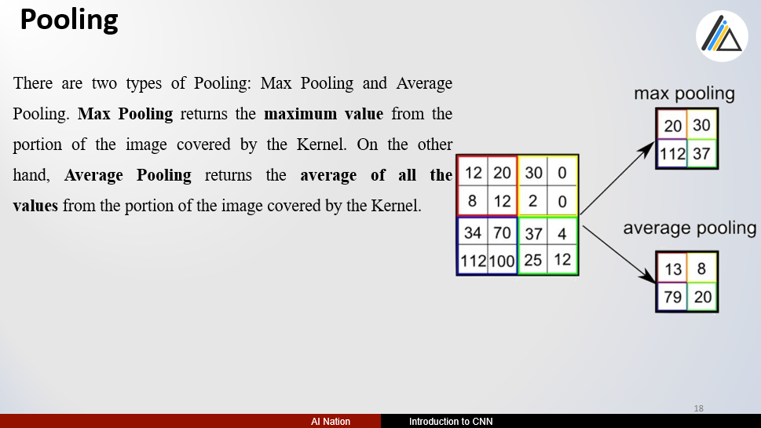
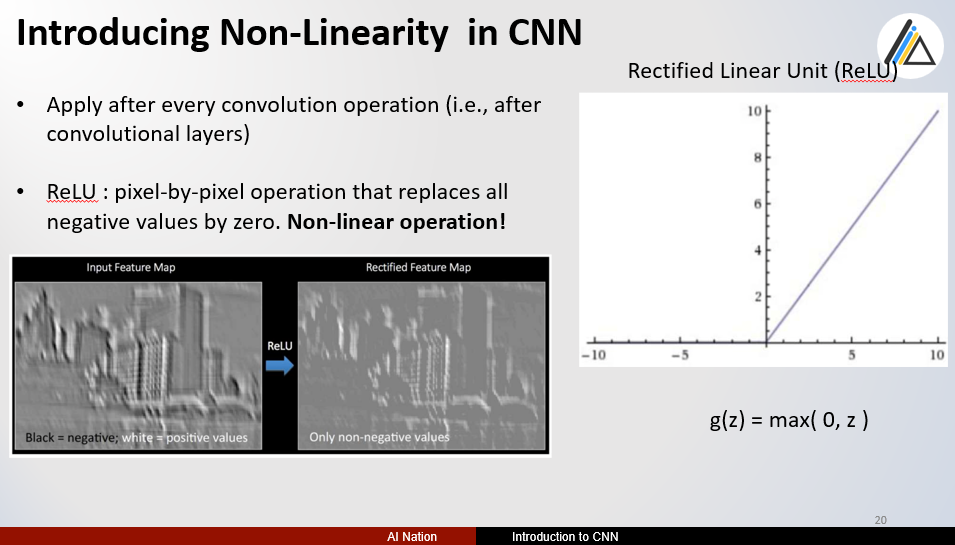
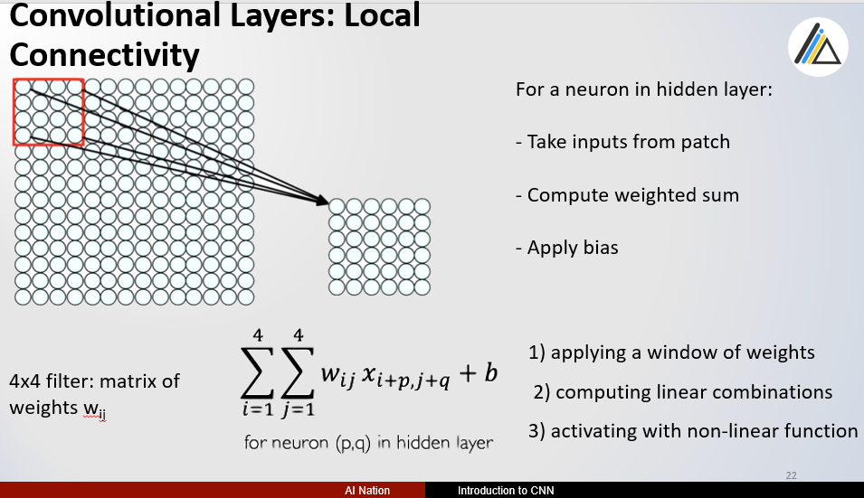
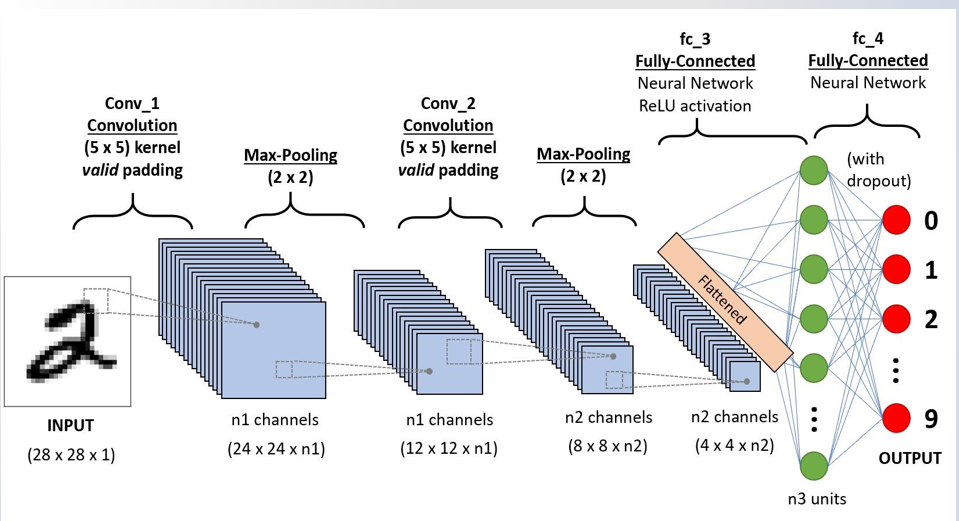

# Decision Tree Algorithm

This Presentation is all about my opinion and how I understand the way.
So any mistake, be patient me.
Ref : lazyprogrammer, Alexander Amini, deeplizard 

**Source Code**

- [native algorithm source code](https://github.com/tharhtetsan/zero_2_hero_python/blob/df95327f6f19d270ec97d8ed704843b78f495214/7_Deep_Learning/ANN/Native%20Simple%20Logistic%20Regression.ipynb)
- [framework usage source code](https://github.com/tharhtetsan/zero_2_hero_python/blob/df95327f6f19d270ec97d8ed704843b78f495214/7_Deep_Learning/ANN/tensorflow%20Simple%20Logistic%20Regression.ipynb)

**If there Any questions?**

You can find me at:

- tharhtet1234@gmail.com
- https://www.facebook.com/tharhtet.san.902
- https://github.com/tharhtetsan
